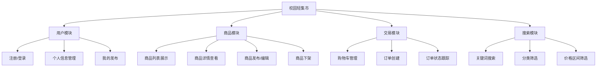

# 校园轻集市 — 项目规划

## 1. 页面清单

| 页面 | 路由路径 | 功能说明 |
|------|---------|---------|
| 首页 | `/` | 商品列表展示、轮播图、分类导航 |
| 商品详情 | `/product/:id` | 商品图片、描述、价格、联系卖家 |
| 商品发布 | `/product/new` | 发布新商品（图片上传、描述、定价） |
| 搜索结果 | `/search` | 关键词搜索 + 分类/价格筛选 |
| 登录 | `/login` | 账号密码登录 |
| 注册 | `/register` | 新用户注册 |
| 个人中心 | `/profile` | 用户信息、我的发布、我的订单 |
| 购物车 | `/cart` | 购物车商品管理 |
| 订单列表 | `/orders` | 所有订单状态概览 |
| 订单详情 | `/order/:id` | 单个订单完整信息 |

## 2. 功能模块

## 3. 开发顺序

| 阶段 | 任务 | 说明 |
|------|------|------|
| **Phase 1** | 项目初始化 | 路由配置、Pinia Store 框架、API 封装 |
| **Phase 2** | 用户模块 | 注册/登录页面、Token 管理、路由守卫 |
| **Phase 3** | 商品展示 | 首页商品列表、商品详情页 |
| **Phase 4** | 商品发布 | 发布表单、图片上传、我的商品管理 |
| **Phase 5** | 搜索筛选 | 关键词搜索、分类/价格筛选 |
| **Phase 6** | 购物车 | 加入购物车、数量管理、结算 |
| **Phase 7** | 订单管理 | 订单列表、订单详情、状态流转 |
| **Phase 8** | 优化收尾 | 错误处理、加载状态、UI 优化 |

## 4. 开发重点

1. **用户认证体系** — Token 存储与刷新、路由守卫、请求拦截，是整个系统的安全基础
2. **商品图片处理** — 图片上传预览、压缩、存储方案，直接影响用户体验
3. **搜索与筛选性能** — 关键词搜索 + 多条件筛选的联合查询，需考虑前端防抖和缓存
4. **订单状态管理** — 订单生命周期（待支付→已支付→已发货→已完成）的状态流转逻辑
5. **响应式布局** — 校园集市以移动端为主，需优先保证手机端体验

> 规划基于校园集市的核心业务场景：**学生之间的二手/闲置物品交易**，兼顾发布便捷性和浏览体验。
